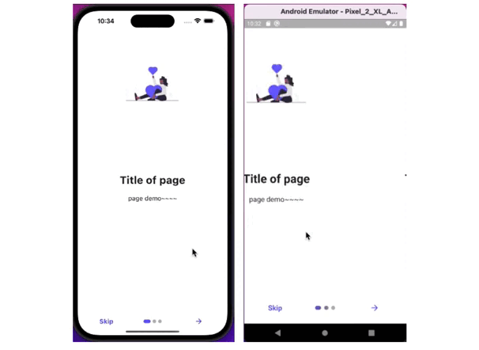

# Flutter introduction_screen
介紹頁面製作 introduction_screen。



在此專案中透過 sharedPreferences 來儲存指定變數來控管 APP 的設定檔資料存取。當使用者點選 Skip/Done 按鈕時自動的將指定變數(isviewed)修改。下次開啟 APP 時會自動的要求 isviewed 變數，來判定是否要觸發介紹頁面。

### 讀取指定 key 資料
```dart
// 使用 Shared Preferences 存取資料
WidgetsFlutterBinding.ensureInitialized();
SharedPreferences prefs = await SharedPreferences.getInstance();
isviewed = prefs.getInt('onBoard');
```

### 寫入指定 key 資料
```dart
storeOnboardInfo() async {
  print("Shared pref called");
  int isViewed = 1;
  SharedPreferences prefs = await SharedPreferences.getInstance();
  await prefs.setInt('onBoard', isViewed);
  print(prefs.getInt('onBoard'));
}
```

### 删除指定 key 資料
```dart
final success = await prefs.remove('onBoard');
```


## Flutter Package
- [introduction_screen](https://pub.dev/packages/introduction_screen)
- [shared_preferences](https://pub.dev/packages/shared_preferences)

## Reference
- [Introduction Screen/Onboarding Screen UI In Flutter](https://www.youtube.com/watch?v=QN0YU5O0N00)
- [SharedPreferences 設定檔資料存取](https://tw-hkt.blogspot.com/2019/08/flutter-sharedpreferences.html)